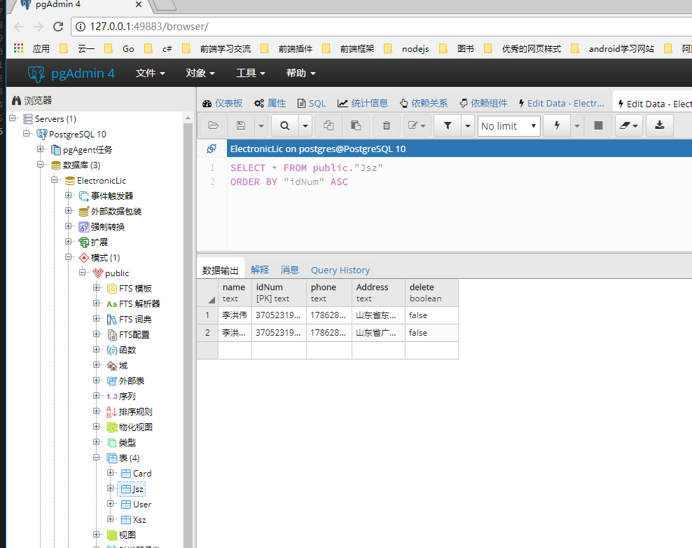

# ElctronicLicenceServer 接口文档
电子证件后台

### 账号相关的接口

- 登陆 GET

    ```/Account/login```   

    示例： http://locakhost:5001/Account/login?data="用encodeComponent编码的 json 格式字符串"
    
    其中 data 要求一个  encode编码 的json对象，该对象的格式 为 
    
        ```
        {
            idNum: 370523199403311023, // 身份证
            name: "姓名", 
            phone: 17862806857
        }
        ```
---------------

- 驾驶证相关
    - 申请驾驶证接口 Get

    ```/Jsz/JszApply```    
    返回数据格式：
    ```
    {
        status="NoLic"
    }
    ```
    状态详情：

    |状态|解释|
    |-|-|
    |ok|成功|
    |Unauthorized|未登录或登录超时|
    |NoLic|用户不存在|

    - 查询驾驶证接口 Get

    ```/Jsz/GetJsz```

    返回数据格式：
    ```
    {
        status = "ok",
        info = jsz
    }
    >  public partial class Jsz
    {
        public string Name { get; set; }
        public string IdNum { get; set; }
        public string Phone { get; set; }
        public string Address { get; set; }
    }
    ```
    |状态|解释|
    |-|-|
    |Unauthorized|用户不存在|
    |ok| 成功|

    jsz字段：
    
    |属性|含义|
    |-|-|
    |name|姓名|
    |idNum| 身份证号|
    |phone|电话|
    |address|住址|

    - 删除驾驶证 Get

    ```Jsz/DeleteJsz```

    返回数据格式：

    ```
    {
        status: "ok"
    }
    ```
    状态列表：

    |状态|含义|
    |-|-|
    |ok|删除成功|
    |Unauthorized|未登录|

- 行驶证相关

    - 查询行驶证列表 Get

    ```Xsz/GetLicenseStatus```

    返回数据格式：

    ```
    {
        status = "ok", 
        jsz = jsz,  // 驾驶证的相关信息
        xsz = xsz // 行驶证的相关信息
    }
    ```
    状态列表：

    |状态|含义|
    |-|-|
    |ok|查询成功|
    |Unauthorized|未登录|   

    - 查询单个驾驶证 Get

    ```Xsz/GetXsz```

    需要参数：
    ```
    string cllx, 
    string hphm
    ```
    请求示例：
    ```
    "/Xsz/GetXsz?hphm=" + carNum + "&cllx=" + carType
    ```
    状态列表：

    |状态|含义|
    |-|-|
    |ok|查询成功|
    |Unauthorized|未登录|  

    - 删除行驶证 Get
    
    ```Xsz/DeleteXsz```

    需要参数：
    ```
    string cllx,
     string hphm
    ```
    请求示例：
    ```
    "/Xsz/DeleteXsz" + "?hphm=" +  carNum + "&cllx=" + carType
    ```

    返回数据格式：

    ```
    {
        status = "ok",
        xsz = xsz
     }
    ```

    状态列表：

    |状态|含义|
    |-|-|
    |ok|删除成功|
    |Unauthorized|未登录|  


### 数据库设计展示：

1. 数据库结构


2. Card表


3. 驾驶证表（Jsz表）


4. 行驶证表


5. 用户表设计
